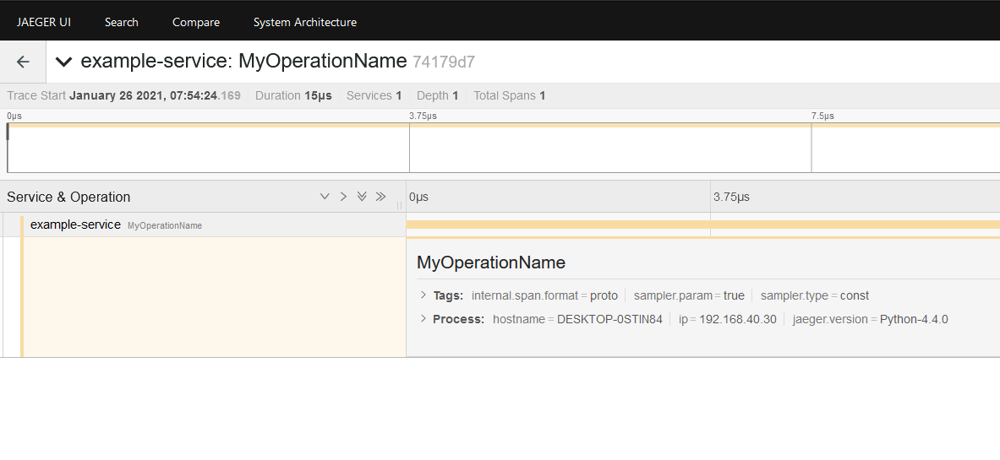
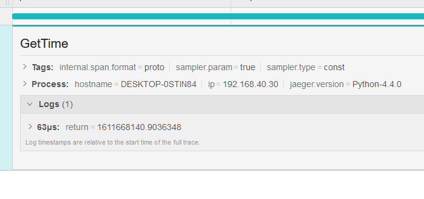

# Quickstart

## Simple Tracing

Get the package from PyPI.

```shell
pip install opentracing-decorator
```

Import and define an instance of the Opentracing Decorator class.

```python
# examples/simple.py

import time

from jaeger_client import Config

from opentracing_decorator import Tracing

# No sampler host and port specified because the Jaeger client picks localhost:6831 by default.
config = Config(
    config={
        "sampler": {
            "type": "const",  # Not advised to have constant sampling in production.
            "param": 1,
        },
        "logging": True,
    },
    service_name="example-service",
    validate=True,
)
jaeger_tracer = config.initialize_tracer()

# Pass in an instance of a tracer implementation.
# Here, we're using the Jaeger client.
tracing = Tracing(tracer=jaeger_tracer)
```

Here, we're using the [Jaeger implementation of
OpenTracing](https://github.com/jaegertracing/jaeger-client-python) for
integration with the Jaeger tracing system. You can use any OpenTracing
compatible tracer. For example, the [Zipkin OpenTracing
client](https://github.com/lookfwd/zipkin-python-opentracing)

I can now annotate any function I want, in order to start generating and pushing traces to the Jaeger server.

```python
# examples/simple.py

@tracing.trace(operation_name="MyOperationName")
def do_some_work(x, y, z):
    return x + y + z
```

Be sure to give the tracer time to report traces so it can clear its buffers
before exiting. Although, the worst thing that could happen if you forget this
is that some of your traces will not show up.

```python
# examples/simple.py

if __name__ == "__main__":
    do_some_work(10, 20, 30)

    # Give some time to report traces.
    time.sleep(5)
    jaeger_tracer.close()
```

At this point, you should see traces start to show up in the user interface.



## Obtain Span Reference

It's generally helpful to access the active Span while doing any sort of processing. This is so that you can do things like add tags, log arbitrary key/value information, etc.

You can configure the Opentracing Decorator to pass a reference to the Span you are within by passing the `pass_span=True` argument to the decorator.

```python
@tracing.trace(operation_name="MyOperationName", pass_span=True)
def do_some_work(x, y, z, span):
    span.set_tag("x", x)
    value = x + y + z
    span.log_kv({"value": value})
    return value
```

If you only desire access to the Span to tag function
parameters and log function return values--take a look at the automatic
parameter tagging feature for an easier way to do this.

## Automatic Parameter Tagging

### Enabling parameter tagging

You can configure the Opentracing Decorator to automatically tag function Spans
with the names and values of the function arguments.

To clarify, if we have a function like this

```python
@tracing.trace(operation_name="GetData")
def get_data(method, url, headers={}):
    return requests.request(method, url, headers=headers)
```

we may want to see the values for `method`, `url`, and `headers` in our Span
tags.

Simply set the `tag_parameters` flag on the decorator.

```python
# examples/automatic_parameter_tagging.py

@tracing.trace(operation_name="GetData", tag_parameters=True)
def get_data(method, url, headers={}):
    return requests.request(method, url, headers=headers)
```

Now our function parameters are tagged and added to the span.


### Adding a tag prefix

You can set a tag prefix by using the `parameter_prefix` argument to the decorator.

```python
@tracing.trace(operation_name="GetData", tag_parameters=True, parameter_prefix='devops')
def get_data(method, url, headers={}):
    return requests.request(method, url, headers=headers)
```

This will put `devops.*` in front of every automatically tagged parameter. This
is useful for avoiding collisions with tags from other applications.

## Automatic Return Value Logging

### Enabling return value logging

You can configure the Opentracing Decorator to automatically log function return values to the Span.

To clarify, if we have a function like this

```python
@tracing.trace(operation_name="GetData")
def get_data(method, url, headers={}):
    return requests.request(method, url, headers=headers)
```

we may want to see log the return value from the api request to our Span for future analysis.

Simply set the `tag_parameters` flag on the decorator.

```python
# examples/automatic_return_value_logging.py

@tracing.trace(operation_name="GetTime", log_return=True)
def get_time():
    return time.time()
```

Now our function return value is logged to the Span.



### Adding a return prefix

You can set a return prefix by using the `return_prefix` argument to the decorator.

```python
@tracing.trace(operation_name="GetTime", log_return=True, return_prefix='devops.return')
def get_time():
    return time.time()
```